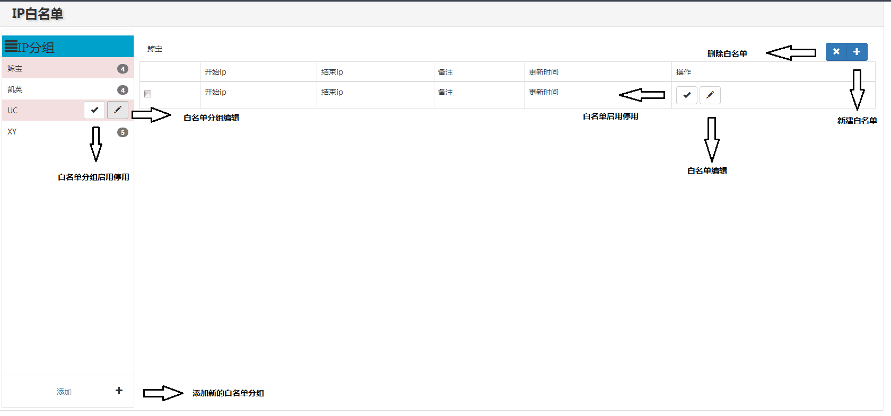

# 服务器白名单管理功能

### 管理功能划分：



#### 一.白名单分组管理：

1.白名单分组创建删除

2.白名单分组状态变更

3.白名单分组信息编辑

4.分组下单个白名单IP编辑

#### 二.白名单管理：

1.白名单创建删除

2.白名单状态变更

3.白名单信息编辑

#### 三.白名单启用状态管理：
```shell

* 单个白名单分组下拥有多个白名单IP

* 白名单中“group_id”关联所属分组的“id”

* 启停用白名单分组状态时：此分组下所有白名单IP状态强制改变

* 下属IP的状态更改不影响白名单分组本身状态

```
